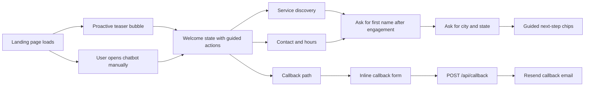
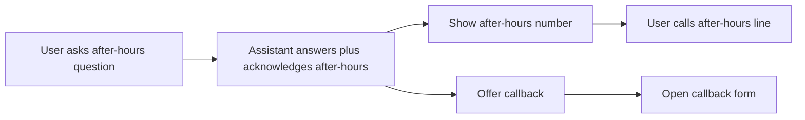
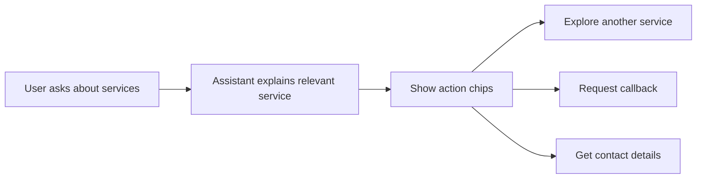
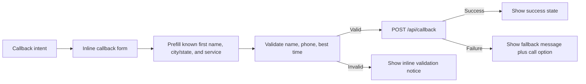
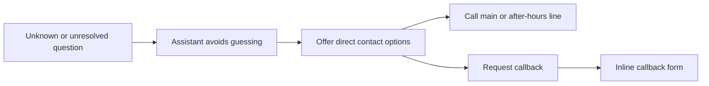
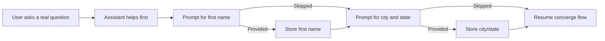

# Isoke Chatbot Flow Diagram

## Main Conversation Flow

```mermaid
flowchart LR
  Start["Landing page loads"] --> Teaser["Proactive teaser bubble"]
  Start --> Launcher["User opens chatbot manually"]
  Teaser --> Welcome
  Launcher --> Welcome["Welcome state with guided actions"]
  Welcome --> Services["Service discovery"]
  Welcome --> Contact["Contact and hours"]
  Welcome --> Callback["Callback path"]
  Services --> Name["Ask for first name after engagement"]
  Contact --> Name
  Name --> Location["Ask for city and state"]
  Location --> Next["Guided next-step chips"]
  Callback --> Form["Inline callback form"]
  Form --> Submit["POST /api/callback"]
  Submit --> Email["Resend callback email"]
```

## After-Hours Flow

```mermaid
flowchart LR
  Ask["User asks after-hours question"] --> Reply["Assistant answers plus acknowledges after-hours"]
  Reply --> Number["Show after-hours number"]
  Reply --> Offer["Offer callback"]
  Offer --> Form["Open callback form"]
  Number --> Call["User calls after-hours line"]
```

## Service Discovery Flow

```mermaid
flowchart LR
  ServiceAsk["User asks about services"] --> Match["Assistant explains relevant service"]
  Match --> Chips["Show action chips"]
  Chips --> More["Explore another service"]
  Chips --> Callback["Request callback"]
  Chips --> Contact["Get contact details"]
```

## Callback Flow

```mermaid
flowchart LR
  Intent["Callback intent"] --> Form["Inline callback form"]
  Form --> Prefill["Prefill known first name, city/state, and service"]
  Prefill --> Validate["Validate name, phone, best time"]
  Validate -->|Valid| Submit["POST /api/callback"]
  Validate -->|Invalid| Error["Show inline validation notice"]
  Submit -->|Success| Confirm["Show success state"]
  Submit -->|Failure| Recover["Show fallback message plus call option"]
```

## Fallback and Escalation Flow

```mermaid
flowchart LR
  Unknown["Unknown or unresolved question"] --> Guardrail["Assistant avoids guessing"]
  Guardrail --> Escalate["Offer direct contact options"]
  Escalate --> Call["Call main or after-hours line"]
  Escalate --> Callback["Request callback"]
  Callback --> Form["Inline callback form"]
```

## Progressive Profile Flow

```mermaid
flowchart LR
  Engage["User asks a real question"] --> Help["Assistant helps first"]
  Help --> Name["Prompt for first name"]
  Name -->|Provided| StoreName["Store first name"]
  Name -->|Skipped| Location["Prompt for city and state"]
  StoreName --> Location
  Location -->|Provided| StoreLocation["Store city/state"]
  Location -->|Skipped| Resume["Resume concierge flow"]
  StoreLocation --> Resume
```
